# 🚀 Builde MLOPs for Prediction ML System
This project build a prediction model and deploy to k8s

# Diabete Prediction Model Deployment
## Table of Contents

1. [Introduction](#introduction)
2. [Prerequisite](#prerequisite)
3. [Develop](#develop)
    - [3.1 Dataset](#dataset)
    - [3.2 Build Model](#build-model)
    - [3.3 Web API](#web-api)
    - [3.4 Observable](#observable-system)
    - [3.5 CI/CD](#cicd)
    - [3.6 Cloud & IAC](#cloud--iac)

## 1. Introduction
This project aims to build a full MLOps pipeline for a machine learning prediction system, focusing on diabetes prediction. It covers the steps from data processing, model training, evaluation, and deployment, to automating workflows with best practices. The goal is to demonstrate a robust, reproducible, and scalable approach to operationalizing ML models in production environments.
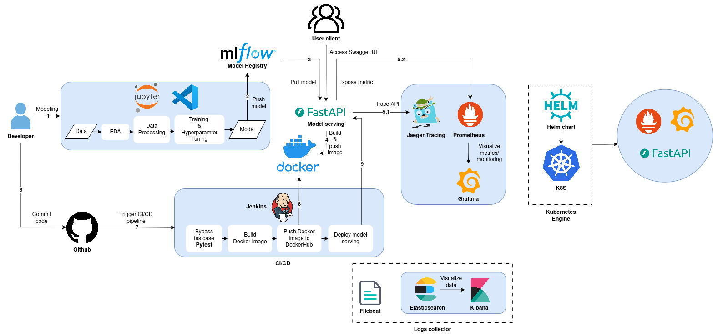

## 2. Prerequisite
To get started with this project, please ensure you have the following installed:

- Python 3.9 
- `anaconda 4.5.11`, `docker 27.1.2` installed

Install the required dependencies using the following commands:
```bash
conda create -n thesis python=3.9
conda activate thesis
pip install -r requirements.txt
```


## 3. Develop
### 3.1 Dataset
> Onset of Diabetes Prediction
Link: [data](https://machinelearningmastery.com/develop-first-xgboost-model-python-scikit-learn/)

This dataset is comprised of 8 input variables that describe medical details of patients and one output variable to indicate whether the patient will have an onset of diabetes within 5 years.
You can learn more about this dataset on the UCI Machine Learning Repository website.

In this project, the dataset will be downloaded and placed in folder **data**

### 3.2 Build Model
**Setting up MLflow Tracking Server with Docker**
```bash
docker compose -f setup_tools/setup-mlflow/docker-compose.yml up -d --build
```
After running the above command, mlflow server will be available at [http://localhost:5000](http://localhost:5000)
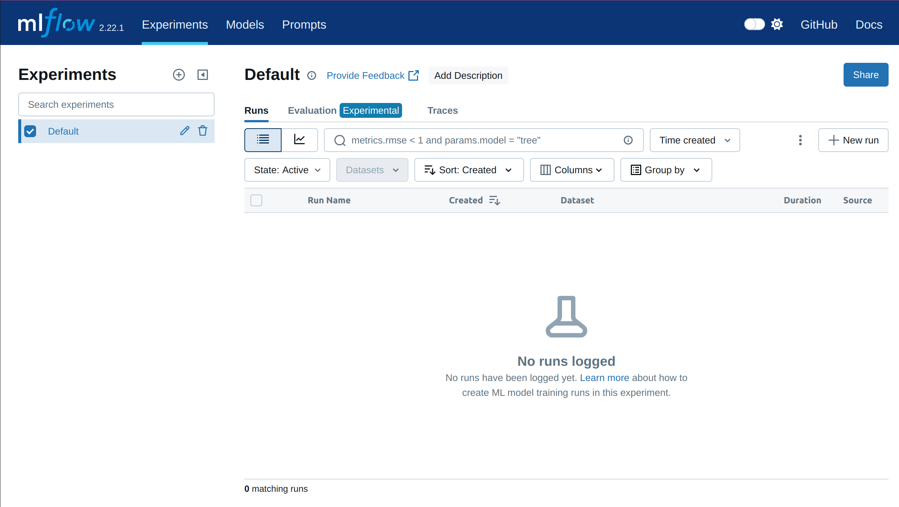

Next we will conduct preprocess dataset and train model

**Prepocessing** \
We wil split the data into training 
```bash
python src/split_data.py
```

**Training**\
Next we will conduct training and pushing model to mlflow model registry

```bash
python src/train.py --model_name xgb
```
After finishing training, open the mlfow webserver, we will see an experiment has been created
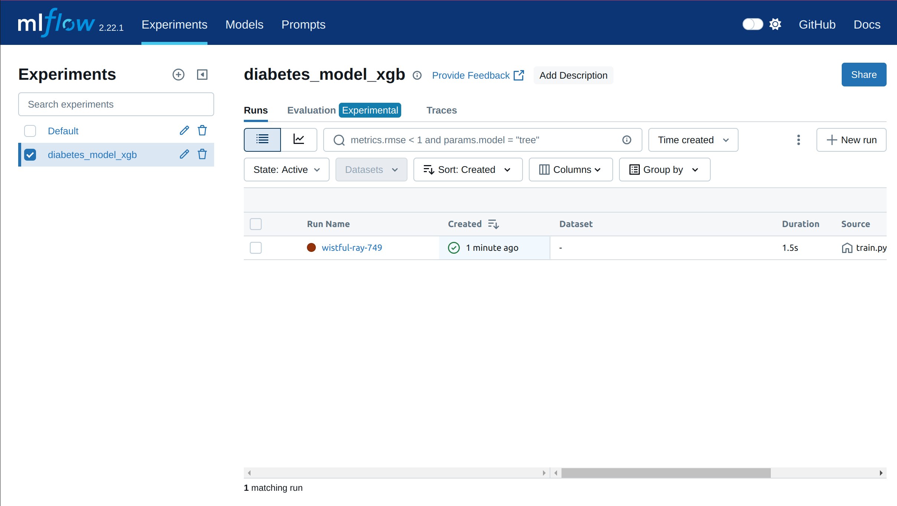

**Prediction**
This will:
- Load the saved model from the MLflow registry (using the default config or the one you provide in the script).
- Run predictions using the validation dataset (`data/val.csv`).
You can specify different model names or versions by editing the script or updating the CLI options inside `src/predict.py`

### 3.3 Web API
In this project, FastAPI and Uvicorn will be use for the backend. To run the RESTful API service, using the following command 

```bash
uvicorn src.main:app --host 0.0.0.0 --port 8080
```
The service will be available at [http://localhost:8080](http://localhost:8080).
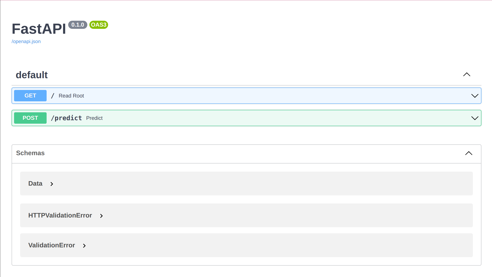

#### API Endpoints
- **POST /predict**  
  - Runs inference using the loaded model.
  - Expects a JSON payload containing:
    - `id`: (string or int) input id/reference
    - `data`: list of lists (rows of feature values)
    - `columns`: list of column names (feature names)

  - Example request:
    ```json
    {
      "id": "123",
      "data": [[5,140,65,35,0,36.6,0.434,56]],
      "columns": ["Pregnancies","Glucose","BloodPressure","SkinThickness","Insulin","BMI","DiabetesPedigreeFunction","Age"]
    }
    ```
  - Example using `curl`:
    ```bash
    curl -X POST "http://localhost:8080/predict" \
         -H "Content-Type: application/json" \
         -d '{
              "id": "123",
              "data": [[5,140,65,35,0,36.6,0.434,56]],
              "columns": ["Pregnancies","Glucose","BloodPressure","SkinThickness","Insulin","BMI","DiabetesPedigreeFunction","Age"]
            }'
    ```
  - Example response:
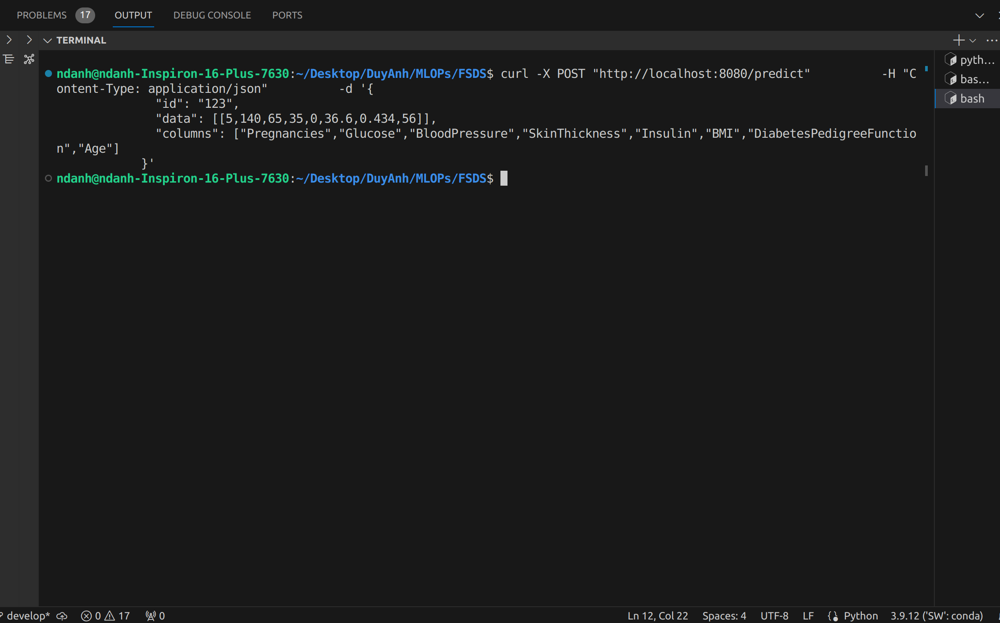

### 3.4 Observable
When we have a service, we need some observable systems to monitoring our service. In this repo, we suggest Elastic Search, Grafana, Prometheus and Jaeger.

#### Observable systems architecture
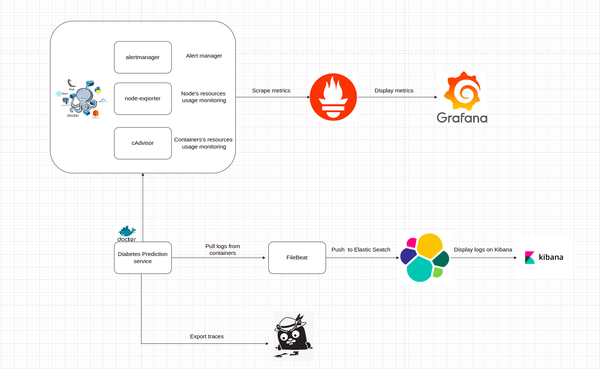
##### Using ELK Stack for Observability
To monitor and observe logs from your ML serving system, you can deploy an ELK stack (Elasticsearch, Logstash, and Kibana).
The ELK stack helps aggregate logs, search through them efficiently, and visualize metrics in real time. Here’s how it fits into the MLOps pipeline:
- **Elasticsearch:** Stores and indexes logs from containers, Kubernetes pods, and other sources.
- **Logstash:** Collects, processes, and forwards logs from various sources into Elasticsearch.
- **Kibana:** Visualizes logs and metrics from Elasticsearch, providing dashboards for rapid troubleshooting and analytics.

##### Deploy ELK
Run command: `docker compose -f deployment/elk/elk-docker-compose.yml -f deployment/elk/extensions/filebeat/filebeat-compose.yml up -d`

##### ELK Stack Setup Instructions
This project includes a pre-configured ELK stack for local observability and log analysis. You can deploy the ELK stack using the provided Docker Compose file.

**Steps to use ELK from `deployment/elk/elk-docker-compose.yml`:**

1. **Prerequisites**  
   Ensure Docker and Docker Compose are installed and running on your host machine.

2. **Start the ELK stack**  
   In the project root directory, run:
   ```bash
   docker compose -f deployment/elk/elk-docker-compose.yml up -d
   ```
   This will start the following services:
   - `elasticsearch` (data store & search engine)
   - `kibana` (dashboard UI)
   - `logstash` (log pipeline—optional configuration as needed)

3. **Access Kibana**  
   Once all containers are running, open your browser and navigate to:  
   [http://localhost:5601](http://localhost:5601)  
   Use Kibana to explore logs and set up dashboards.
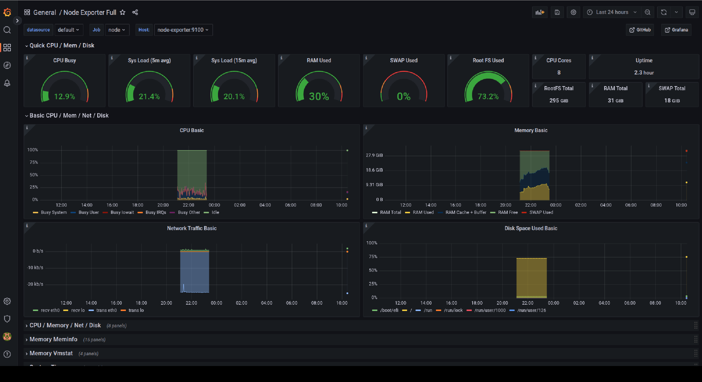

Real-time Log Streaming & Checking
To view logs in real time and monitor your services instantly, you can use built-in Docker log streaming or tools like Kibana's "Discover" tab. This setup lets you observe log output and troubleshoot your ML system as it runs.
    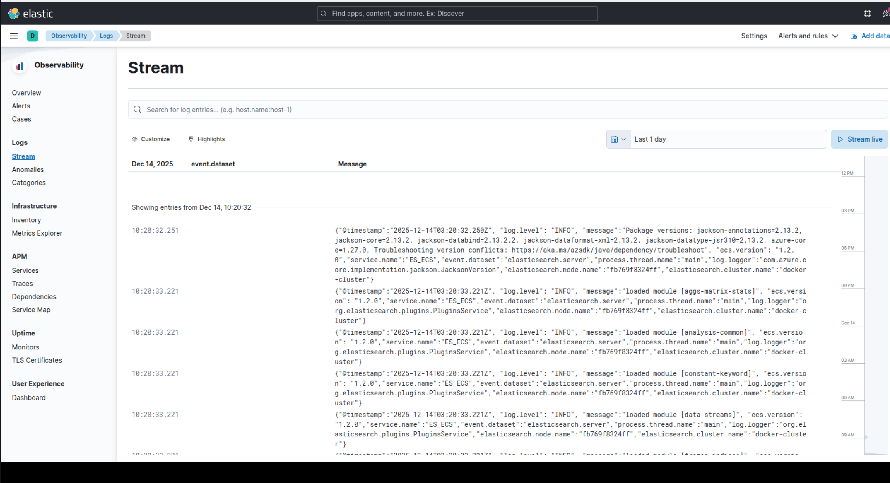
`

#### Prometheus, Grafana & Jaeger Setup Instructions

This project includes a Docker Compose configuration for setting up observability and tracing using **Prometheus**, **Grafana**, and (optionally) **Jaeger**. This monitoring stack enables you to collect, monitor, and visualize performance metrics and traces from your ML service.

**Steps to use Prometheus & Grafana from `setup_tools/prom-graf-docker-compose.yaml`:**

1. **Prerequisites**  
   - Ensure Docker and Docker Compose are installed and available on your system.
   - The machine should have free ports: `9090` (Prometheus), `9100` (Node Exporter), `3000` (Grafana), `8090`, `8099`.

2. **Start the Monitoring Stack**  
   In your project root, run:
   ```bash
   docker compose -f deployment/prom-graf-docker-compose.yaml up -d
   ```
   This will spin up the following services:
   - `prometheus`: Metrics collection and alerting
   - `grafana`: Dashboard and visualization interface
   - `node-exporter`: Machine-level metrics
   - `cadvisor`: Container resource statistics
   - `alertmanager`: Alert management
   - `demo-metrics`: Example service being monitored

3. **Access Grafana and Prometheus Dashboards**
**Grafana:**  
Visit [http://localhost:3000](http://localhost:3000)  

**Prometheus:**  
Visit [http://localhost:9090](http://localhost:9090)
AI Predict exposes log counts request via a metrics endpoint (`/predict`), Prometheus can scrape and show these values.Use the search bar to query metrics such as: `ai_request_counter_total` 
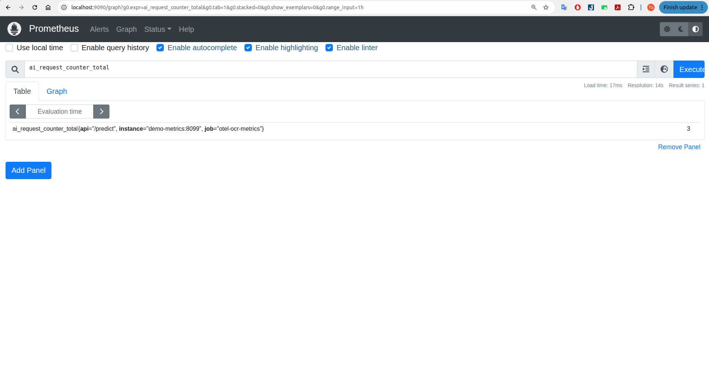

4. **Explore Node and Container Metrics**  
   - **Node Exporter** is available on [http://localhost:9100/metrics](http://localhost:9100/metrics)
   - **cAdvisor** UI is available at [http://localhost:8090](http://localhost:8090)
6. **Alerting**
   - Alertmanager and alert rules are configurable under `./setup_tools/prometheus/config/alert-rules.yml`.
7. **Tracing with Jaeger**
   - **Jaeger** is included in the stack for distributed tracing (see service `jaeger` in the compose file).
   - Jaeger collects and visualizes traces from your applications, helping you analyze request propagation and performance bottlenecks.
   - **Access the Jaeger UI** at: [http://localhost:16686](http://localhost:16686)
   - Explore traces, operations, and timing details for requests to the ML API, get service `ai-serving` 
   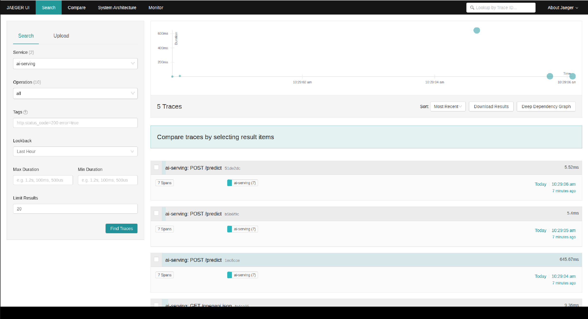

### 3.5 CI/CD
#### Setup Jenkins
- docker compose -f setup_tools/jenkins/docker-compose.yml up -d
- Jenkins service was exposed at port 8081, we can access by this port
- Expose port 8080 in local machine to internet through ngrok.
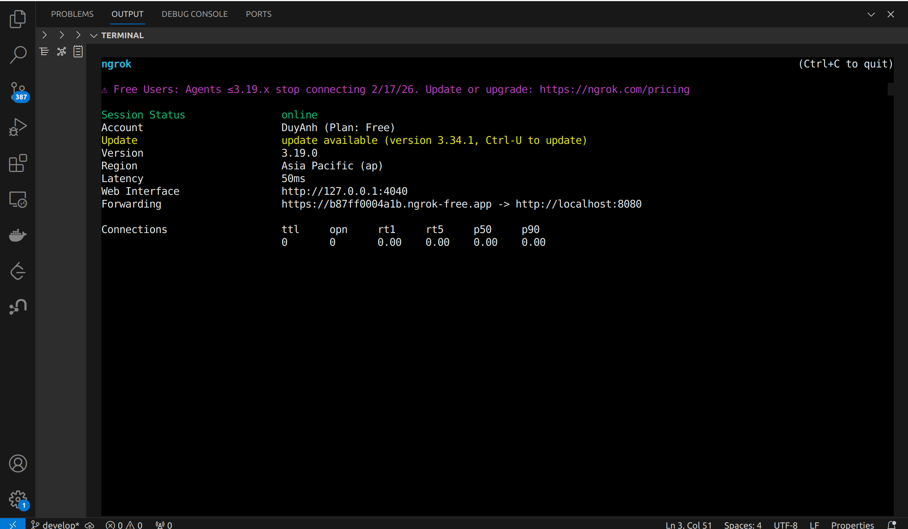

- Jenkins credentials set up:
  - **Github**: Username/Password or Personal Access Token (as a secret)
  - **DockerHub**: Username/Password (as a DockerHub credential in Jenkins)

- Setup Webhooks so that github can connect to local Jenkins
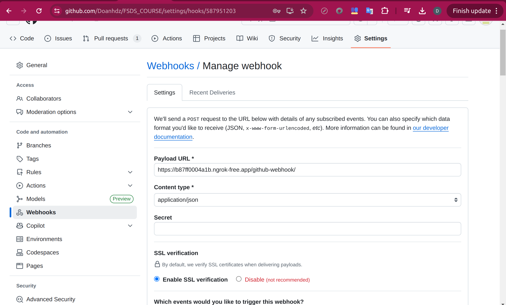
- Access to Jenkins, click New Item to create new Multibranch Pipeline
- In Configuration/Branch Sources, choose GitHub in Add source


### 3.6 Cloud & IAC
To deploy this solution on cloud infrastructure wit Google Cloud Platform, you can automate resource provisioning using [Terraform](https://www.terraform.io/). Below is a general guide for creating a compute VM and optionally a Kubernetes cluster.

#### Prerequisites
**3.6.1 Google account & GCP project**
   - Make sure you have a [Google Cloud Platform (GCP) account](https://console.cloud.google.com/).
   - [Create a new GCP project](https://console.cloud.google.com/cloud-resource-manager) or select an existing one.
   - Note your **Project ID** (you'll need this for configuration).
**3.6.2 Set up billing and APIs**
   - Ensure billing is enabled for your project.
   - Enable the following APIs in the [APIs & Services dashboard](https://console.cloud.google.com/apis/library):
     - Compute Engine API
     - Kubernetes Engine API
     - Artifact Registry API (if you plan to store Docker images)
     - Service Account Credentials API\
**3.6.3 Install & initialize Google Cloud CLI**

   - Install the [Google Cloud SDK](https://cloud.google.com/sdk/docs/install) if not already done.
   - Authenticate and set your project by running:
     ```bash
     gcloud auth login
     gcloud config set project <YOUR_PROJECT_ID>
     ```
**3.6.4 Install Terraform**
- Follow the [Terraform installation guide](https://developer.hashicorp.com/terraform/downloads) for your platform.
- Common installation steps for Linux/macOS:
  ```bash
  # Download latest Terraform (update link as needed)
  wget https://releases.hashicorp.com/terraform/1.8.5/terraform_1.8.5_linux_amd64.zip
  unzip terraform_1.8.5_linux_amd64.zip
  sudo mv terraform /usr/local/bin/
  terraform -v
  ```
Once installed, you should be able to run:
```bash
terraform -version
```

**3.6.5 Create Cluster and VM Instance on GCP**
Initialize and deploy with Terraform
From the `iac/terraform/` directory, run:
```bash
terraform init
terraform plan
terraform apply
```
Cluster on GCP:
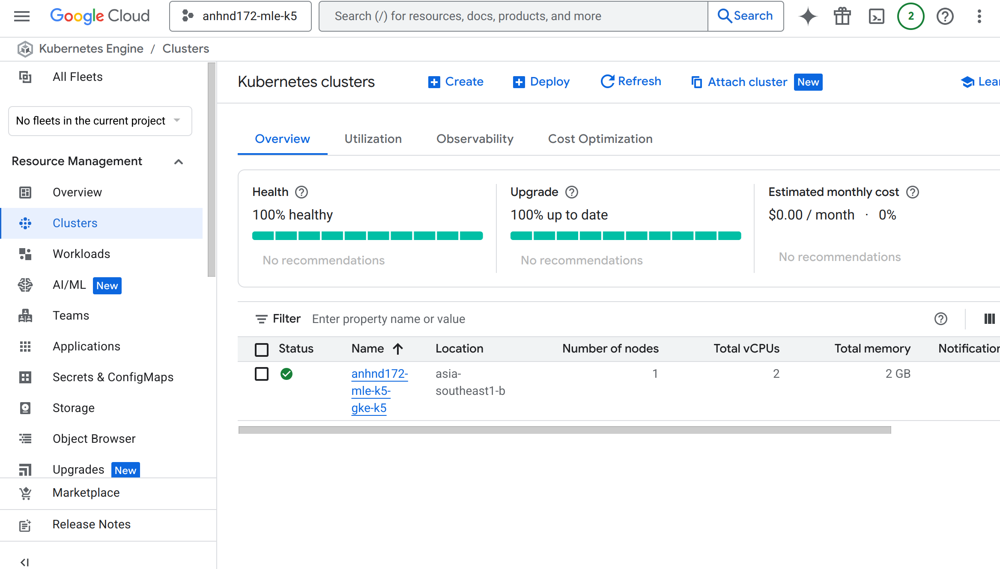
VM on GCP
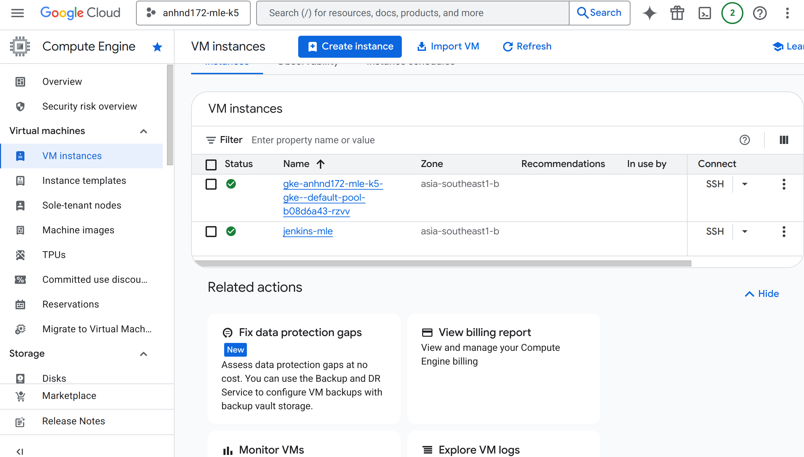

#### Deploy service to cluster GCP
Config kubeconfig to connect to cluster: 
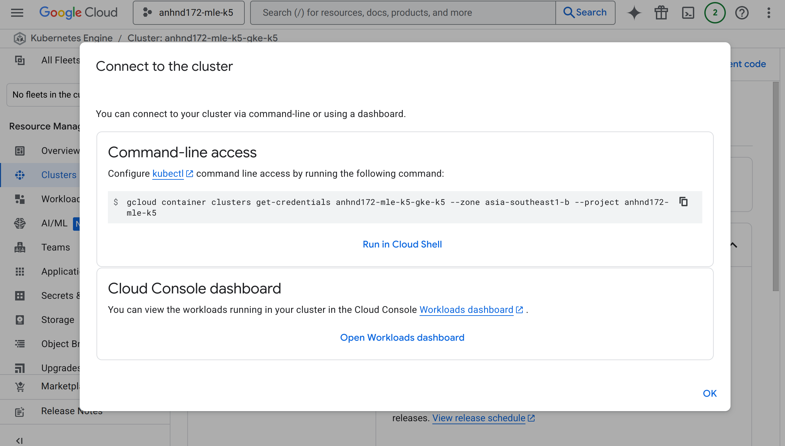
The following commands will deploy the NGINX ingress controller and the machine learning model service to your Kubernetes cluster on GCP:
```bash
# deploy nginx
kubectl create ns nginx-system
kubens nginx-system
cd k8s/helm/nginx-ingress
helm upgrade --install nginx-ingress .
# deploy model 
kubectl create ns model-serving
kubens model-serving
cd k8s/helm/diabetes
helm upgrade --install serving .
```
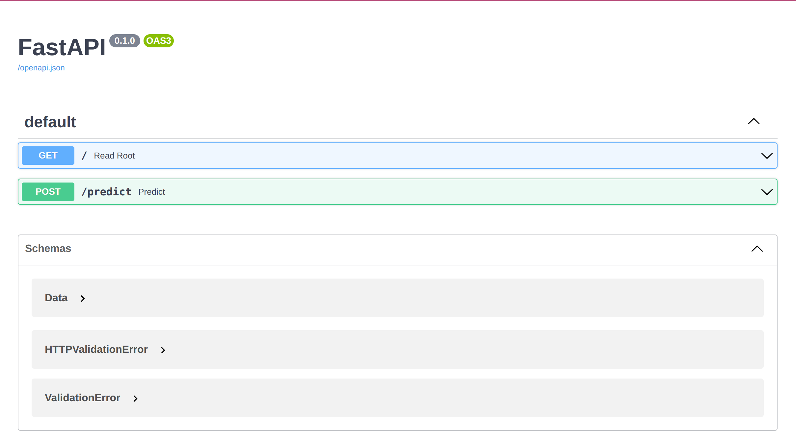

