# 🚀 Builde MLOPs for Prediction ML System
This project build a local data platform

## 📑 Table of Contents
- [📊 Dataset](#-dataset)
- [🌐 Architecture Overview](#-architecture-overview)
  - [1. Datalake](#1-datalake)
  - [2. Source System](#2-source-system)
  - [3. Streaming Precessing](#3-streaming-processing)
  - [4. Pipeline Orchestration](#4-pipeline-orchestration)
  - [5. Feature Store](#5-feature-store)

## 🛠️ Prerequisite
To get started with this project, please ensure you have the following installed:
- Python 3.9 
- `anaconda 24.5.0`, `docker 27.5.1` installed

Install the required dependencies using the following command:
```bash
conda create -n thesis_2 python=3.9
conda activate thesis_2
pip install -r requirements.txt
```

## 📊 Dataset
> NYC taxi dataset
Link: [data](https://www.nyc.gov/site/tlc/about/tlc-trip-record-data.page)
The data i work in this project is NYC taxi data. About dataset, Yellow and green taxi trip records include fields capturing pick-up and drop-off dates/times, pick-up and drop-off locations, trip distances, itemized fares, rate types, payment types, and driver-reported passenger counts. The data used in the attached datasets were collected and provided to the NYC Taxi and Limousine Commission (TLC) by technology providers authorized under the Taxicab & Livery Passenger Enhancement Programs (TPEP/LPEP). The format data i use in this Project is Parquet file.


## 1. Datalake
### Start our data lake infrastructure
```shell
docker compose -f src/datalake/data-lake-with-mino.yaml up -d
```

Convert data to delta format and push to MinIO
```shell
# generata data
python src/datalake/utils/convert_delta_format.py
# push data to minio 
python src/datalake/utils/export_data_to_datalake_minio.py
```
After pushing the data to MinIO, access `MinIO` at 
`http://localhost:9001/`, you should see your data already there.
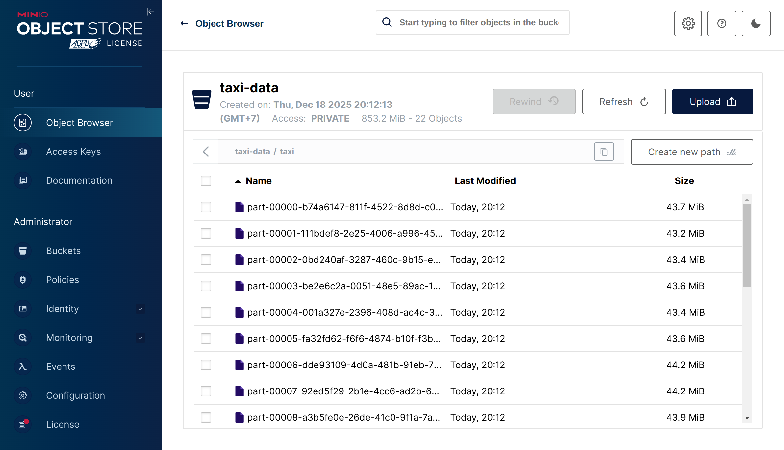
### Create data schema
After putting your files to `MinIO`, please execute `trino` container by the following command:
```shell
docker exec -ti datalake-trino bash
```
When you are already inside the `trino` container, typing `trino` to in an interactive mode
After that, run the following command to register a new schema for our data:
```sql
---Create a new schema to store tables
CREATE SCHEMA IF NOT EXISTS lakehouse.taxi
WITH (location = 's3://taxi-data/');

---Create a new table in the newly created schema
CREATE TABLE IF NOT EXISTS lakehouse.taxi.taxi (
    VendorID VARCHAR(50),
    tpep_pickup_datetime VARCHAR (50),
    tpep_dropoff_datetime VARCHAR (50),
    passenger_count DECIMAL,
    trip_distance DECIMAL,
    RatecodeID DECIMAL, 
    store_and_fwd_flag VARCHAR(50), 
    PULocationID VARCHAR(50),
    DOLocationID VARCHAR(50), 
    payment_type VARCHAR(50), 
    fare_amount DECIMAL, 
    extra DECIMAL, 
    mta_tax DECIMAL, 
    tip_amount DECIMAL, 
    tolls_amount DECIMAL, 
    improvement_surcharge VARCHAR(50),
    total_amount DECIMAL,
    congestion_surcharge DECIMAL, 
    Airport_fee DECIMAL
    ) WITH (
    location = 's3://taxi-data/taxi'
);
```
### Query with DBeaver
1. Install `DBeaver` as in the following [guide](https://dbeaver.io/download/)
2. Connect to our database (type `trino`) using the following information (empty `password`):
  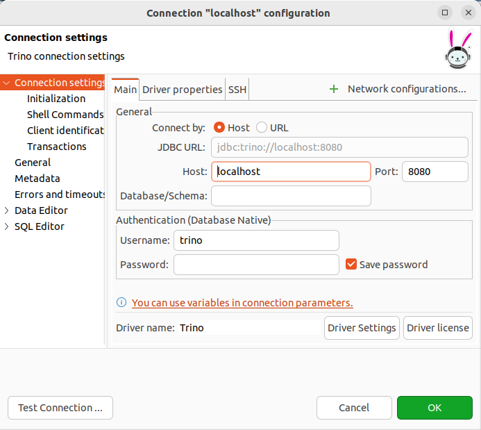

### Run continuous cdc postgresql kafka
```bash
cd src/cdc-postgresql-kafka
docker compose up -d
```
#### Register Connectior: 
Connect Debezium with PostgreSQL to receive any updates from the database
```bash
bash streaming/run.sh register_connector configs/postgresql-cdc.json
```
You can check connector on web ui debezium ui `localhost:8085`
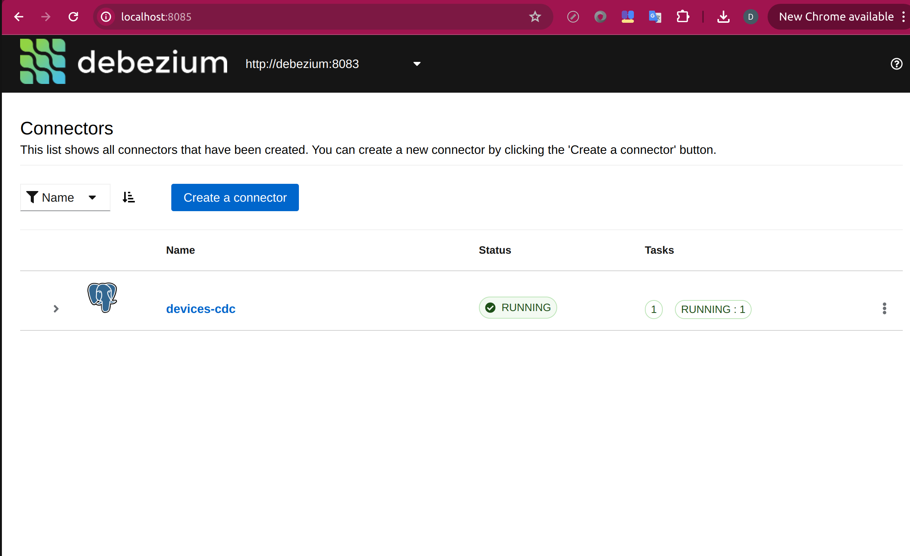
Run fake data: 
```bash
python streaming/utils/create_table.py
python streaming/utils/insert_table.py
```
You can check log kafka on control-centre `localhost:9021`.
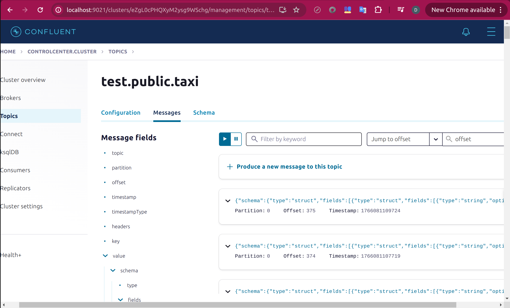


## 2. Batch Processing
Run batch processing with Spark and save data to datatwarehouse with format file .parquet.
```bash
python src/batch-processing-with-spark/scripts/batch_processing.py
```
You will show output: 
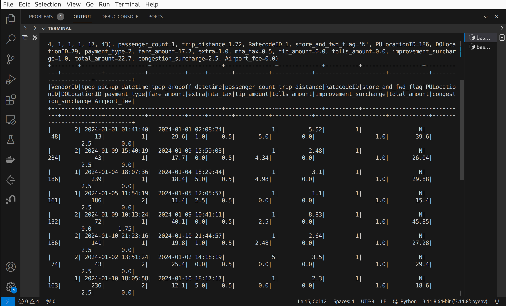
## 3. Streaming Processing
Deploy Streaming Processing with Kafka and Flink. 
Run commnand to start: `docker compose up -f src/streaming-processing/docker-compose.yaml -d`
You can check if Kafka producer is running normally by using
```shell
docker logs flink-kafka-producer
```
After that, get message from kafka and run flink for processing, send output back to kafka with topic `sink_taxi`. 
Run command: `python src/streaming-processing/scripts/table_api.py`
Check control-center in `localhost:9021` to view message
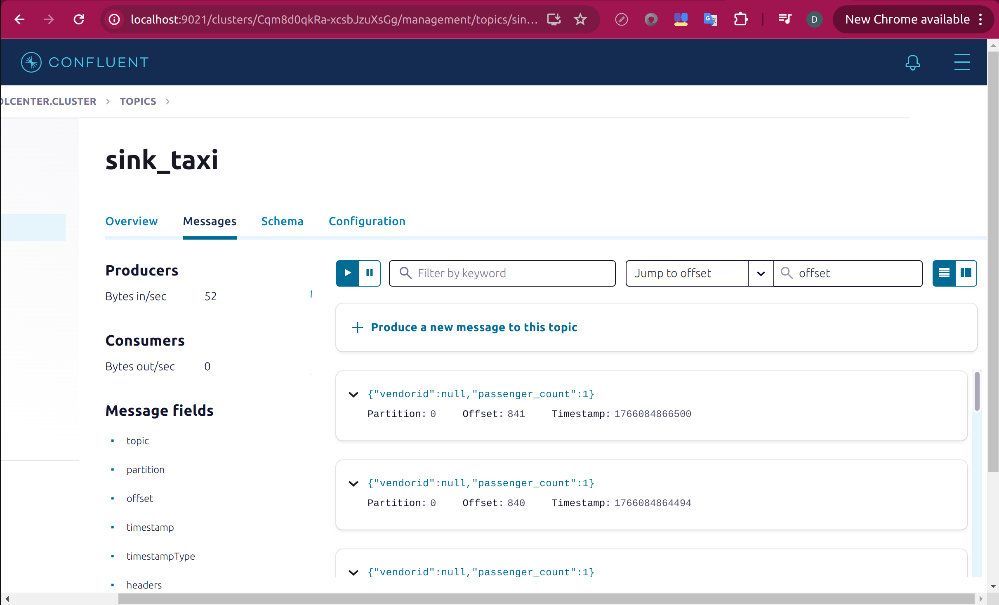

```shell
docker compose -f src/streaming-processing/docker-compose.yaml up -d
```
### Register connectors
Connect Debezium with PostgreSQL to receive any updates from the database
```shell
cd src/cdc-postgresql-kafka
bash streaming/run.sh register_connector configs/postgresql-cdc.json
```
### Initialize the database
```shell
# Create an empty table in PostgreSQL
python streaming/utils/create_table.py
# Periodically insert a new record to the table
python streaming/utils/insert_table.py
```
## Observe new records on Kafka
Access the `control center` at the address `http://localhost:9021/` to see the new records
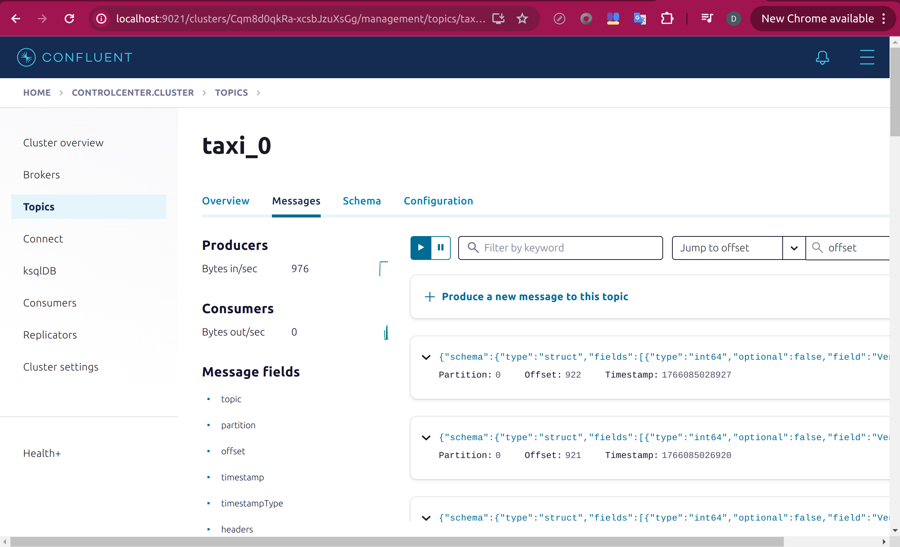

You can also verify whether your CDC connecter has been registered successfully in `control center`


## 4. Pipeline Orchestration
Create pipeline orchstration with Airflow. Follow this step: 
```bash 
docker compose -f src/pipeline-orchestration up -d
```
Check all service are ready. Go to Airflow `localhost:8080`, Acc: `airflow/airflow`
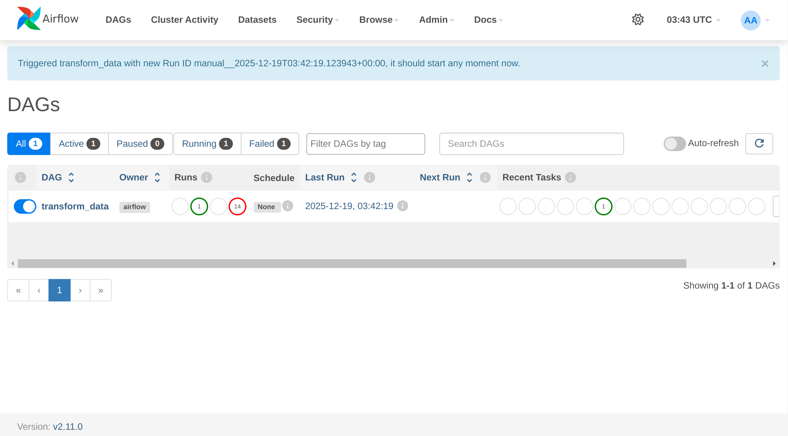
Create a job to ingest data from the data lake (MinIO), perform transformation and feature engineering, and load it into the data warehouse (PostgreSQL). Check file `src/pipeline-orchestration/run_env/dags/transform_data.py`. 
When job run successed, check output in database. 
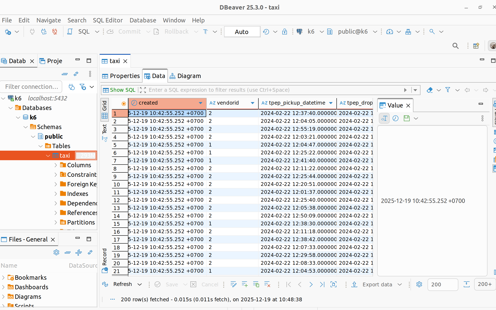

## 5. Feature Store
#### Run service docker
Init feature store: 
```bash
cd src/feature-store/feature_repos/taxi
feast apply
```
Retrieve the training data
```shell
cd src/feature-store/feature_retrieval/taxi
python retrieve_training_data.py
```
Output: 
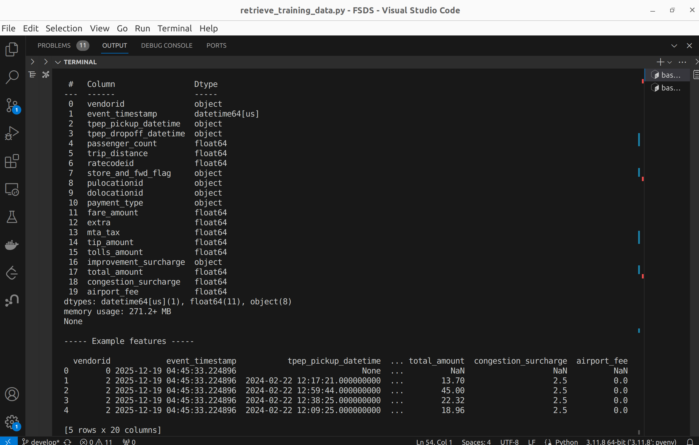
Ingest batch features into your online store
```shell
bash materialize.sh
``` 
Retrieve data for inference from online store
```shell
python retrieve_online_features.py
```
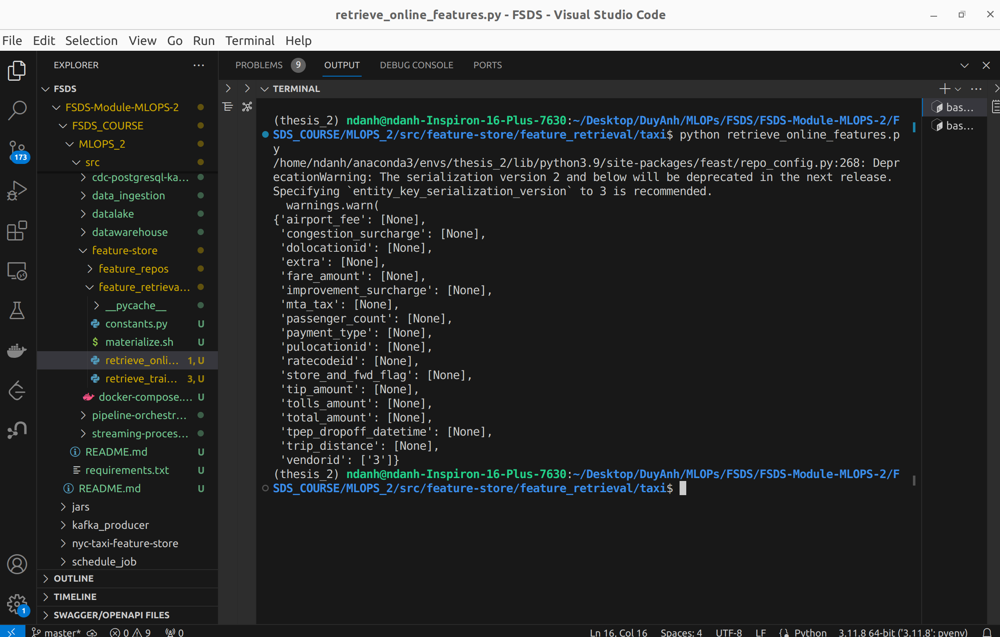