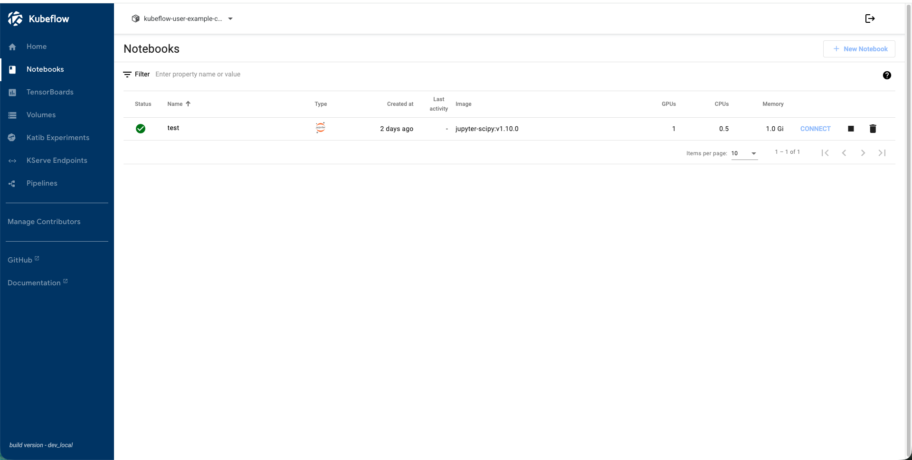
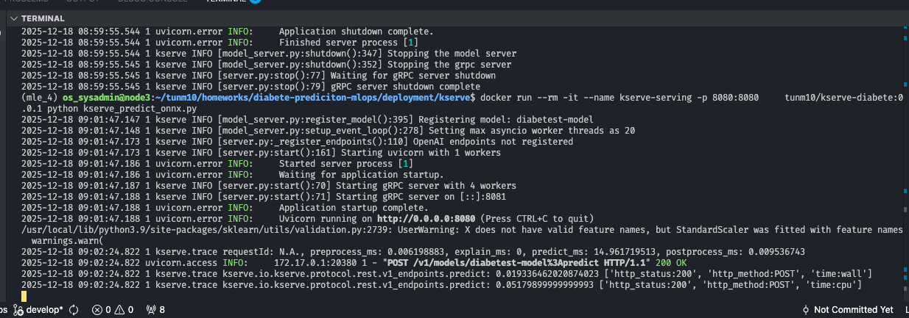
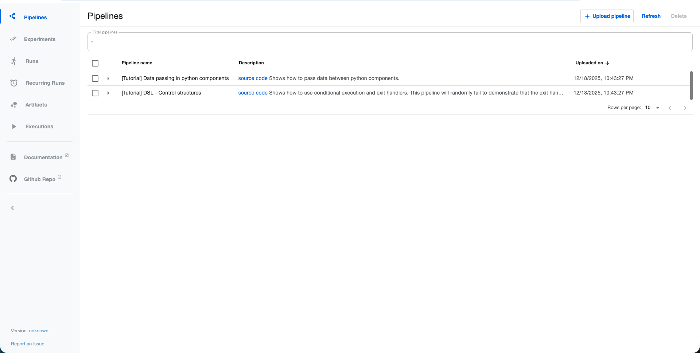
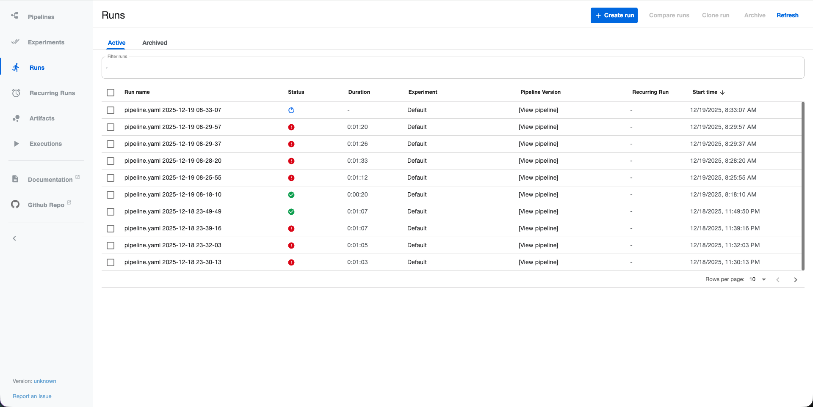
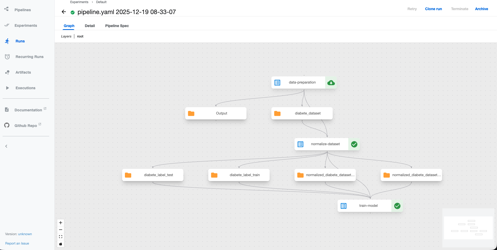
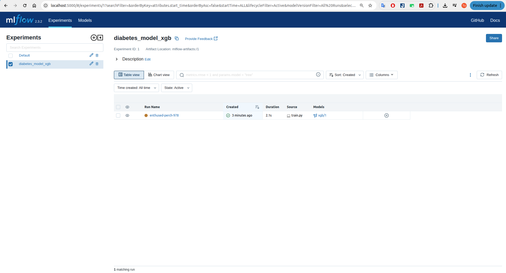

# 🚀 Builde MLOPs for Prediction ML System
This project serving model with Kserve

## Serving Advanced
### Prerequisite
Run mlflow service: `docker compose -f src/deploy-mlflow up -d`
#### Serving with model onnx and triton inferenc serve
```bash
# training model 
python src/train.py
python src/model2onnx.py
docker run --rm --name triton-serving -p 8000:8000 -p 8001:8001 -p 8002:8002 \
    -v ./models/triton-models:/models \
    nvcr.io/nvidia/tritonserver:23.12-py3 tritonserver --model-repository=/models
```
#### Serving model with kserve 
```bash
python src/kserve_predict_onnx.py
```
Model with serving `localhost:8000`
Test with curl:
```bash
curl -X POST -H "Content-Type: application/json"   -d '{
        "input_data": [
            [6,103,66,0,0,24.3,0.249,29],
            [3,89,74,16,85,30.4,0.551,38]
        ]
      }'   http://localhost:8080/v1/models/diabetest-model:predict

### Response
Output: [[0,0],[[0.99314135,0.006858647],[0.9728105,0.027189493]]]                                                         `
```
### Kubeflow
Install `kubeflow 1.10` from link `https://github.com/kubeflow/manifests/tree/v1.10-branch`
After install. Login with user `user@example.com/12341234`


#### Build serving image
Build custom image seving kserve with onnx: 
```bash
cd deployment/kserve
docker build -t anhnd172/kserve-diabete:0.0.1 .
```
Run command check:
```bash
docker run -d --name kserve-serving -p 8080:8080 \
    anhnd172/kserve-diabete:0.0.1
```

Test: 
```bash
curl -X POST -H "Content-Type: application/json"   -d '{
        "input_data": [
            [6,103,66,0,0,24.3,0.249,29],
            [3,89,74,16,85,30.4,0.551,38]
        ]
      }'   http://localhost:8080/v1/models/diabetest-model:predict
## Output: 
[[0, 0], [[0.9931413531303406, 0.006858646869659424], [0.9728105068206787, 0.02718949317932129]]](
```
Apply to cluster K8s: `k apply -f src/kserve/diabete_classification.yaml -n kubeflow-user-example-com`

Check service ready with kserve on kubeflow dashboard. 


Run test: 
```bash
Export NodePort service and run 
curl -X POST -H "Content-Type: application/json"   -d '{
        "input_data": [
            [6,103,66,0,0,24.3,0.249,29],
            [3,89,74,16,85,30.4,0.551,38]
        ]
      }'   http://<ip>:<nodeport>/v1/models/diabetest-model:predict
# Output
[[0, 0], [[0.9931413531303406, 0.006858646869659424], [0.9728105068206787, 0.02718949317932129]]]
```

#### Kubeflow Pipeline for training
Setup Kubeflow Pipeline:
```bash
# Run service kubeflow-pipeline
export PIPELINE_VERSION=2.15.0
kubectl apply -k "github.com/kubeflow/pipelines/manifests/kustomize/cluster-scoped-resources?ref=$PIPELINE_VERSION"
kubectl wait --for condition=established --timeout=60s crd/applications.app.k8s.io
kubectl apply -k "github.com/kubeflow/pipelines/manifests/kustomize/env/dev?ref=$PIPELINE_VERSION"
# Export this command
kubectl port-forward --address 0.0.0.0 -n kubeflow svc/ml-pipeline-ui 8080:80
```


Run pipline kubeflow get data from data source, training model and push model to model registry: 
```bash
cd src/kubeflow-pipeline
python client.py
```
Run comand to push pipeline to kubeflow pipeline: 
```bash
python ./client.py
# OUtput
/home/os_sysadmin/miniconda3/envs/dl/lib/python3.9/site-packages/kfp/client/client.py:159: FutureWarning: This client only works with Kubeflow Pipeline v2.0.0-beta.2 and later versions.
  warnings.warn(
Experiment details: http://10.24.1.39:8080/#/experiments/details/2f21e99a-527e-4c71-8760-42442fab6ae9
Run details: http://10.24.1.39:8080/#/runs/details/d4a92de1-816a-4ef4-aa8d-0536e8886715)
```

Check pipeline run: 

After pipline done, output model save to mlflow registry:

